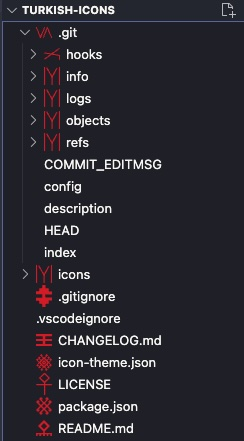

# turkish-icons README

A carefully crafted Visual Studio Code icon theme inspired by the rich symbolism, patterns, and motifs of Turkish culture and history.

## Demo



## ✨ Features

- Unique, modern SVG icons inspired by traditional Turkish visual elements.
- Over 60 file types supported: programming languages, configuration files, markup files, and more.
- Special folder icons and file icons that reflect meaningful cultural symbols.

## 📦 Installation

1. Download the `.vsix` file (if available), or
2. Install via Marketplace (once published):

```bash
ext install cucer.turkishicons
```

## Usage

- `Linux` & `Windows` > **File > Preferences > File Icon Theme > Turkish Icons**.
- `MacOS` > **Code > Preferences > File Icon Theme > Turkish Icons**.

## ⚡ Copyright

All icons in this extension are original works. Redistribution or reuse without permission is prohibited.

## License

[MIT](LICENSE)
